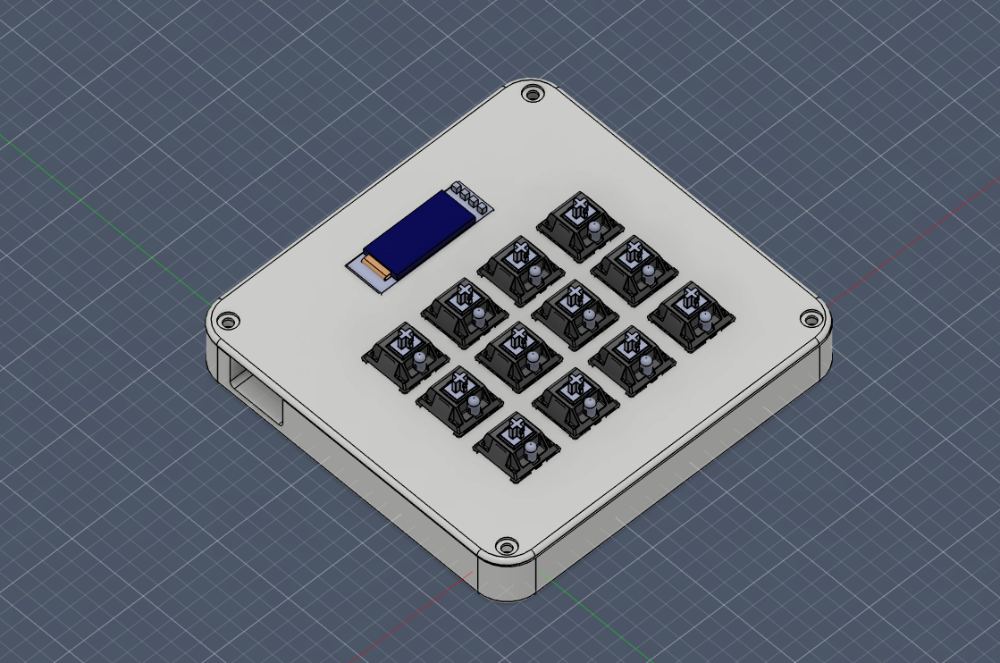
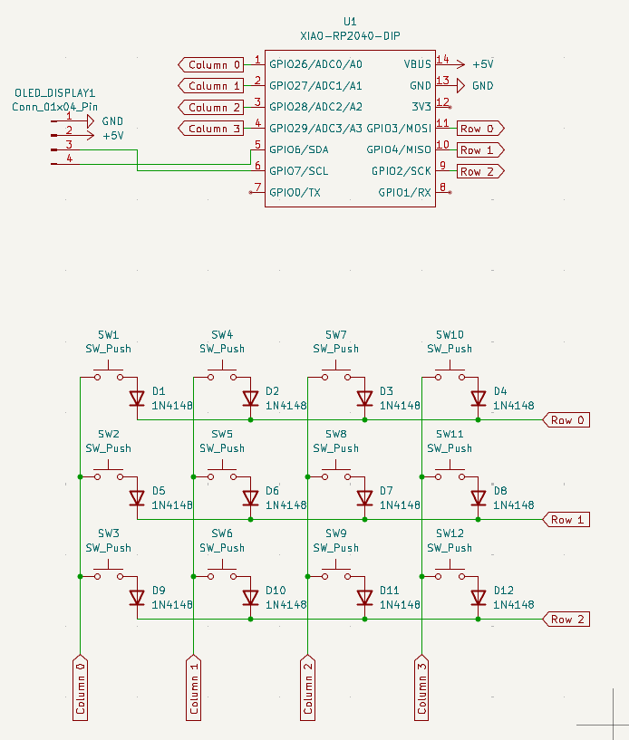
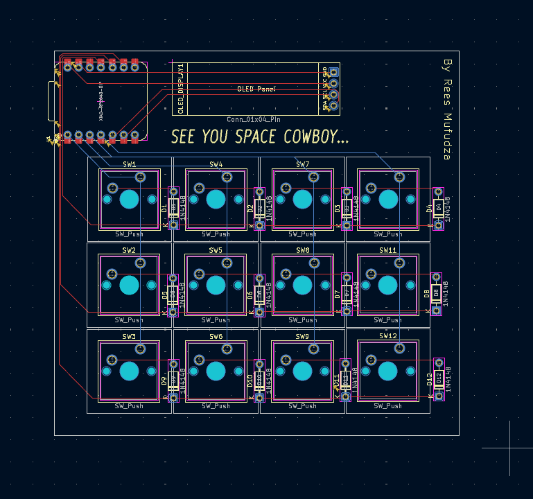
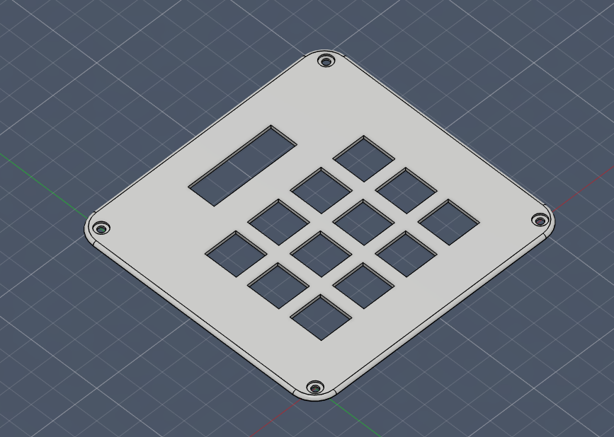
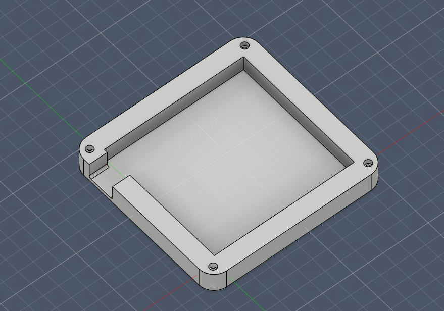

# GOATPad
My first attempt at a macropad for Hack Club. Designed to use with for hotkeys on CAD (fusion 360) and digital art (krita).

This entire project took 15+ hours, most of which was spent navigating and battling fusion 360. Designing the PCB was the most straightforward process, despite 3 iterations of it being created during the process I pulled through. All in all this was a fun project, and I learnt a lot about the CAD and PCB design workflow. 

(PS. The actual thing has key caps...)

### Featuring:
- Xiao RP2040 Microcontroller
- 12 keys (3x4 Matrix PCB)
- SSD1306 0.91" OLED display
- An imaculate 3D printed case designed by yours truly
- Silkscreen easter egg (iykyk)

<h2> Schematic</h2>

<h2> PCB Traces</h2>

<h2> Case</h2>

### Firmware
I made it using QMK (all files included), however it has yet to be tested...

### BOM
- 1x Xiao RP2040
- 1x Case (2x 3D Printed parts)
- 1x 0.91" 128x32 SSD1306 OLED Display
- 12x Cherry MX Switches
- 12x DSA Caps
- 12x 1N4148 DO-35 Diodes
- 4x M3x16mm Screws
- 4x M3x5mx4mm Heat Inserts
