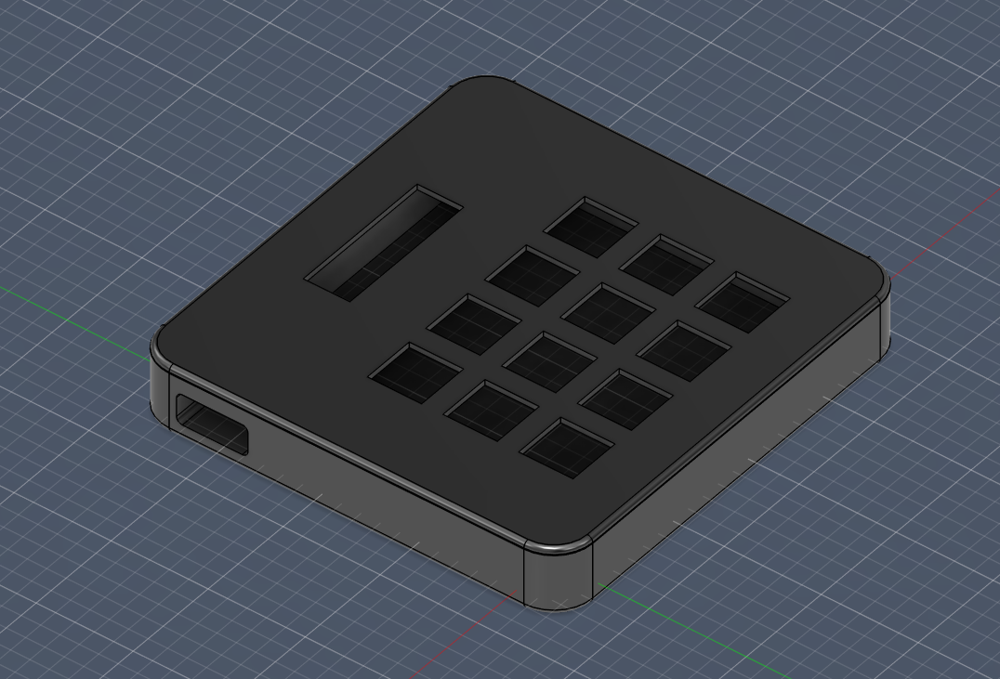

# GOATPad (W.I.P)
My first attempt at a macropad for Hack Club. Designed to use with for hotkeys on CAD (fusion 360) and digital art (krita).

### Featuring:
- RP2040 Microcontroller
- 12 keys (3x4 Matrix PCB)
- SSD1306 0.91" OLED display
- An imaculate 3D printed case designed by yours truly

<h2> Schematic</h2>

<h2> PCB Traces</h2>

<h2> Case</h2>

### BOM
- 1x Xiao RP2040
- 1x Case (2x 3D Printed parts)
- 1x 0.91" 128x32 SSD1306 OLED Display
- 12x Cherry MX Switches
- 12x DSA Caps
- 12x 1N4148 DO-35 Diodes
